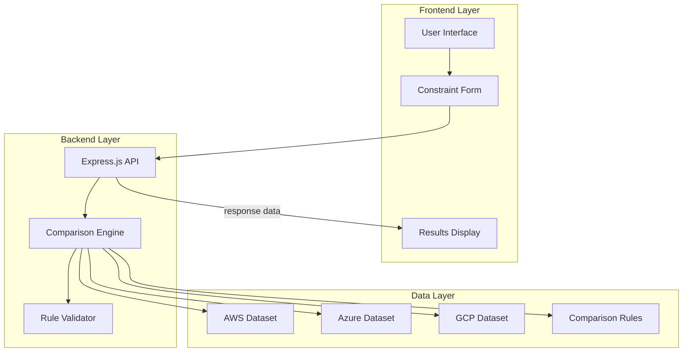

# Design Document: Cloud Platform Comparison Tool

## Overview

The Cloud Platform Comparison Tool is a deterministic web application that serves as an impartial technical referee for comparing AWS, Microsoft Azure, and Google Cloud Platform (GCP). The system employs a rule-based architecture to ensure transparent, consistent, and explainable comparisons without external AI dependencies.

The application follows a three-tier architecture with a React-based frontend for user interaction, a Node.js/Express.js backend for request processing, and a structured JSON data layer containing comprehensive cloud provider information. The core comparison engine implements deterministic rules that process user constraints and generate neutral, comprehensive comparisons across multiple evaluation dimensions.

## Architecture

The system follows a layered architecture pattern with clear separation of concerns:



### Frontend Architecture
- **Technology Stack**: HTML5, CSS3, vanilla JavaScript
- **Constraint Selection Interface**: Form-based UI for capturing user requirements
- **Results Presentation**: Structured display following the mandatory output format
- **Responsive Design**: Mobile-friendly interface for accessibility

### Backend Architecture
- **Framework**: Node.js with Express.js
- **API Design**: RESTful endpoints for constraint processing and comparison generation
- **Middleware**: Request validation, error handling, and response formatting
- **Rule Engine**: Deterministic comparison logic with transparent decision paths

### Data Architecture
- **Storage Format**: Structured JSON files for each cloud provider
- **Schema Consistency**: Standardized data structure across all providers
- **Version Control**: Trackable changes to provider data and comparison rules
- **Validation**: Data integrity checks on application startup

## Components and Interfaces

### User Interface Components

**ConstraintSelector**
- Purpose: Capture user requirements and preferences
- Interface: Form inputs for budget, experience level, workload type, and priorities
- Validation: Client-side validation for required fields and constraint combinations
- Output: Structured constraint object for backend processing

**ResultsRenderer**
- Purpose: Display comparison results in the mandatory format
- Interface: Structured HTML presentation with clear sections for each provider
- Features: Expandable sections, trade-off highlighting, and decision guidance
- Accessibility: Screen reader compatible with semantic HTML structure

### Backend Components

**ComparisonEngine**
- Purpose: Core logic for processing constraints and generating comparisons
- Interface: 
  - Input: User constraints object
  - Output: Structured comparison results
- Methods:
  - `processConstraints(constraints)`: Validates and normalizes user input
  - `evaluateProviders(constraints)`: Applies rules to generate provider assessments
  - `generateTradeOffAnalysis(results)`: Creates cross-provider comparison
  - `formatOutput(analysis)`: Ensures mandatory output structure compliance

**RuleProcessor**
- Purpose: Implements deterministic comparison rules
- Interface:
  - Input: Provider data and user constraints
  - Output: Provider evaluation scores and explanations
- Methods:
  - `applyConstraintRules(provider, constraints)`: Evaluates provider against constraints
  - `calculateDimensionScores(provider, dimension)`: Scores providers on specific dimensions
  - `generateExplanations(scores)`: Creates transparent reasoning for evaluations

**DataManager**
- Purpose: Manages cloud provider data and rule sets
- Interface:
  - Methods for loading, validating, and accessing provider data
- Features:
  - JSON schema validation
  - Data caching for performance
  - Hot-reload capability for data updates

### API Endpoints

**POST /api/compare**
- Purpose: Process user constraints and return comparison results
- Request Body: 
  ```json
  {
    "constraints": {
      "budget": "low|medium|high",
      "experience": "beginner|intermediate|expert",
      "workload": "startup|enterprise|research",
      "priorities": ["cost", "scalability", "ease-of-use", "compliance"]
    }
  }
  ```
- Response: Structured comparison following mandatory output format
- Error Handling: Validation errors, processing failures, data integrity issues

**GET /api/health**
- Purpose: System health check and data validation status
- Response: System status, data integrity checks, rule validation results

## Data Models

### Provider Data Schema

```json
{
  "provider": {
    "name": "string",
    "displayName": "string",
    "lastUpdated": "ISO8601",
    "dimensions": {
      "cost": {
        "pricingModel": "string",
        "freeTrierOffering": "object",
        "costPredictability": "number",
        "budgetFriendliness": "number"
      },
      "easeOfUse": {
        "learningCurve": "number",
        "documentation": "number",
        "setupComplexity": "number",
        "uiIntuitiveness": "number"
      },
      "scalability": {
        "globalPresence": "number",
        "autoScaling": "number",
        "performanceConsistency": "number",
        "infrastructureMaturity": "number"
      },
      "ecosystem": {
        "serviceCount": "number",
        "integrationOptions": "number",
        "thirdPartySupport": "number",
        "communitySize": "number"
      },
      "devops": {
        "cicdSupport": "number",
        "automationTools": "number",
        "containerSupport": "number",
        "infrastructureAsCode": "number"
      },
      "aiml": {
        "mlServices": "number",
        "dataProcessing": "number",
        "pretrainedModels": "number",
        "customModelSupport": "number"
      },
      "enterprise": {
        "compliance": "number",
        "support": "number",
        "sla": "number",
        "securityFeatures": "number"
      },
      "vendorLockIn": {
        "portability": "number",
        "standardsCompliance": "number",
        "exitStrategy": "number"
      }
    },
    "strengths": ["string"],
    "weaknesses": ["string"],
    "idealUseCases": ["string"],
    "tradeOffs": {
      "gains": ["string"],
      "losses": ["string"]
    }
  }
}
```

### Constraint Processing Model

```json
{
  "constraintRules": {
    "budget": {
      "low": {
        "weightings": {
          "cost": 0.4,
          "easeOfUse": 0.3,
          "scalability": 0.1,
          "enterprise": 0.1,
          "ecosystem": 0.1
        },
        "filters": {
          "cost.budgetFriendliness": ">= 7"
        }
      },
      "medium": {
        "weightings": {
          "cost": 0.25,
          "scalability": 0.25,
          "ecosystem": 0.25,
          "easeOfUse": 0.15,
          "enterprise": 0.1
        }
      },
      "high": {
        "weightings": {
          "enterprise": 0.3,
          "scalability": 0.25,
          "ecosystem": 0.2,
          "cost": 0.15,
          "easeOfUse": 0.1
        }
      }
    }
  }
}
```

### Output Structure Model

```json
{
  "comparison": {
    "timestamp": "ISO8601",
    "constraints": "object",
    "providers": {
      "aws": {
        "strengths": ["string"],
        "weaknesses": ["string"],
        "idealUseCases": ["string"],
        "tradeOffs": "object"
      },
      "azure": {
        "strengths": ["string"],
        "weaknesses": ["string"],
        "idealUseCases": ["string"],
        "tradeOffs": "object"
      },
      "gcp": {
        "strengths": ["string"],
        "weaknesses": ["string"],
        "idealUseCases": ["string"],
        "tradeOffs": "object"
      }
    },
    "crossProviderAnalysis": {
      "costTradeOffs": "string",
      "complexityTradeOffs": "string",
      "ecosystemTradeOffs": "string",
      "flexibilityTradeOffs": "string"
    },
    "decisionGuidance": {
      "costOptimized": ["string"],
      "easeOfUse": ["string"],
      "enterprise": ["string"],
      "innovation": ["string"]
    }
  }
}
```

## Correctness Properties

*A property is a characteristic or behavior that should hold true across all valid executions of a system-essentially, a formal statement about what the system should do. Properties serve as the bridge between human-readable specifications and machine-verifiable correctness guarantees.*

### Property 1: Deterministic Comparison Consistency
*For any* set of user constraints, submitting the same constraints multiple times should produce identical comparison results with no variation in content, structure, or recommendations.
**Validates: Requirements 2.1, 2.2**

### Property 2: Constraint Capture and Validation
*For any* valid constraint selection, the system should properly capture all constraint values and validate them before processing, rejecting incomplete or invalid constraint sets with appropriate error messages.
**Validates: Requirements 1.2, 1.3, 1.5**

### Property 3: Mandatory Output Structure Compliance
*For any* comparison result, the output should contain all required sections (strengths, weaknesses, ideal use-cases, trade-offs for each provider, cross-provider analysis, and decision guidance) in the specified format without numerical rankings or definitive recommendations.
**Validates: Requirements 4.1, 4.2, 4.3, 4.4, 4.5**

### Property 4: Comprehensive Dimension Evaluation
*For any* provider evaluation, all mandatory comparison dimensions (cost, ease of use, scalability, ecosystem, DevOps, AI/ML, enterprise features, vendor lock-in risk, and workload suitability) should be assessed and included in the analysis.
**Validates: Requirements 6.1, 6.2, 6.3, 6.4, 6.5, 6.6, 6.7, 6.8, 6.9, 6.10**

### Property 5: Neutrality and Multi-Option Presentation
*For any* comparison result, the system should maintain neutral language, present multiple valid provider options, and never recommend a single definitive choice while explicitly explaining trade-offs for each option.
**Validates: Requirements 5.1, 5.2, 5.3, 5.4**

### Property 6: Local Data Source Integrity
*For any* comparison generation, the system should use only local JSON datasets without external API calls, and all provider data should be retrievable from structured local files with validated integrity.
**Validates: Requirements 2.4, 3.1, 3.2, 3.3, 3.5**

### Property 7: Constraint-Specific Processing Logic
*For any* constraint type (budget, experience, workload, priorities), the system should apply appropriate weighting and filtering rules that emphasize relevant provider characteristics matching the specified constraint category.
**Validates: Requirements 8.1, 8.2, 8.3, 8.4, 8.5, 8.6, 8.7, 8.8**

### Property 8: Data Update Reflection
*For any* modification to provider datasets, subsequent comparisons should reflect the updated information, demonstrating that the system properly reloads and incorporates data changes.
**Validates: Requirements 3.4**

### Property 9: Architectural Layer Separation
*For any* system operation, the frontend, backend, and data layers should maintain clear interfaces and separation of concerns, with the logic engine operating as a deterministic, rule-based system.
**Validates: Requirements 7.3, 7.4, 7.5**

### Property 10: Bias Detection and Prevention
*For any* comparison output, the system should detect and reject responses containing systematic bias, promotional language, or unfair favoritism toward any single provider.
**Validates: Requirements 5.5**

## Error Handling

The system implements comprehensive error handling across all layers:

### Frontend Error Handling
- **Constraint Validation**: Client-side validation prevents submission of incomplete or invalid constraint combinations
- **Network Errors**: Graceful handling of API communication failures with user-friendly error messages
- **Display Errors**: Fallback rendering for malformed comparison results

### Backend Error Handling
- **Request Validation**: Strict validation of incoming constraint data with detailed error responses
- **Processing Failures**: Graceful handling of comparison engine failures with diagnostic information
- **Data Integrity**: Detection and reporting of corrupted or missing provider data

### Data Layer Error Handling
- **Schema Validation**: JSON schema validation for all provider datasets on startup and updates
- **File System Errors**: Handling of missing or inaccessible data files with appropriate fallbacks
- **Corruption Detection**: Checksums and integrity validation for critical data files

### Error Response Format
All errors follow a consistent structure:
```json
{
  "error": {
    "code": "string",
    "message": "string",
    "details": "object",
    "timestamp": "ISO8601"
  }
}
```

## Testing Strategy

The testing strategy employs a dual approach combining unit tests for specific scenarios and property-based tests for comprehensive validation:

### Unit Testing Approach
- **Component Testing**: Individual testing of UI components, API endpoints, and data processing functions
- **Integration Testing**: End-to-end testing of constraint processing workflows
- **Edge Case Testing**: Specific tests for boundary conditions, invalid inputs, and error scenarios
- **Example-Based Testing**: Concrete tests for specific constraint combinations and expected outputs

### Property-Based Testing Configuration
- **Testing Framework**: Jest with fast-check for property-based testing
- **Test Iterations**: Minimum 100 iterations per property test to ensure comprehensive input coverage
- **Test Tagging**: Each property test tagged with format: **Feature: cloud-platform-comparison-tool, Property {number}: {property_text}**
- **Generator Strategy**: Smart generators that create realistic constraint combinations and provider data variations

### Testing Coverage Requirements
- **Functional Coverage**: All comparison dimensions, constraint types, and output formats
- **Error Coverage**: All error conditions, validation failures, and edge cases
- **Performance Coverage**: Response time validation and data loading performance
- **Security Coverage**: Input sanitization and data integrity validation

### Test Organization
- **Unit Tests**: Co-located with source files using `.test.js` suffix
- **Property Tests**: Dedicated test files for each major component with property validation
- **Integration Tests**: Separate test suite for end-to-end workflow validation
- **Data Tests**: Validation tests for JSON schema compliance and data integrity

The testing strategy ensures that both specific examples work correctly (unit tests) and that universal properties hold across all possible inputs (property tests), providing comprehensive validation of system correctness and reliability.
